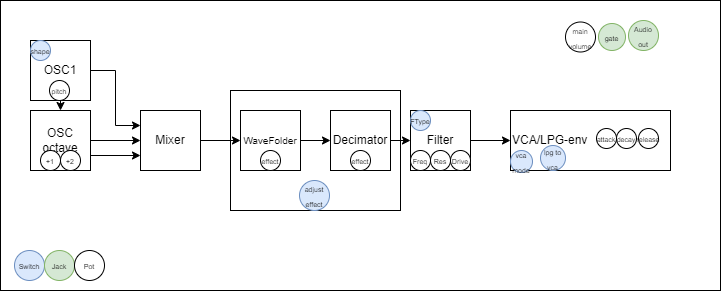
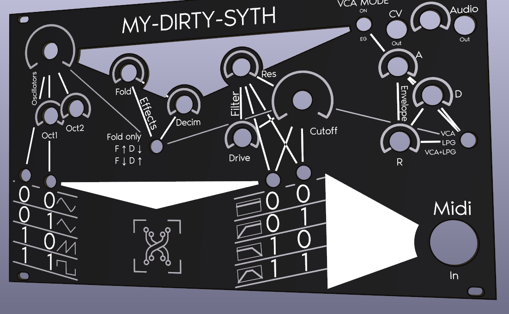
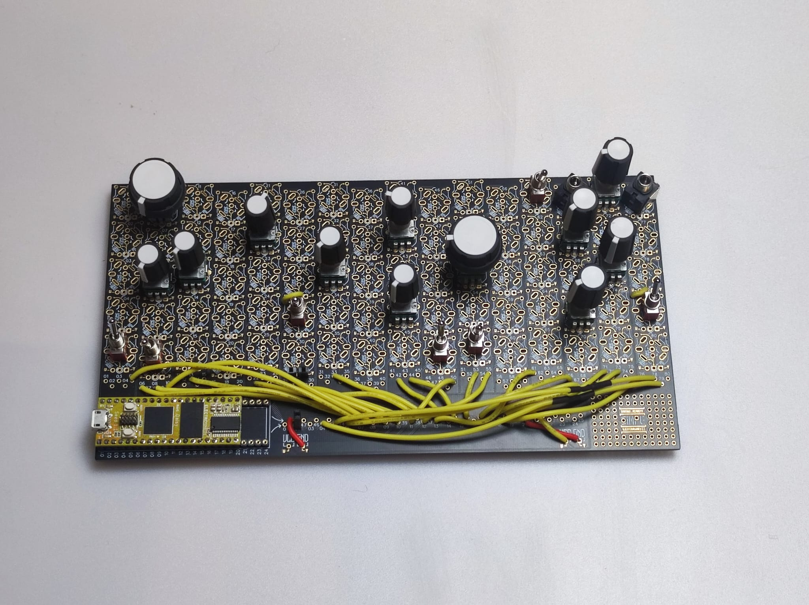

# My-Dirty-Synth

Content:
 - Main Arduino code of the synth : [My-Dirty-Synth.ino](../master/My-Dirty-Synth.ino)
 - Front panel PCB in kicad 6.0 : hardware - [hardware - dirty synth folder](../master/hardware%20-%20dirty%20synth)

# Infos
This git contains all the files to realize your own "My-Dirty-Synth" made with the [Simple Synth kit](https://www.synthux.academy/simple) made by synthux academy. The synth is based on a [Daisy seed](https://www.electro-smith.com/daisy/daisy) by electro-smith and uses their Arduino library [DaisyDuino](https://github.com/electro-smith/DaisyDuino).


Each component of the synth (potentiometer, switch, jack) comes from the Simple Synth kit except what is linked to MIDI. For this, a custom PCB acting like a front panel has been made.

## Daisyduino warning

I'm using the daisysp wavefolder, it is not yet in the daisyduino library (tested the 19.04.2024 with daisyduino 1.6.3).

You need to get them in the daisysp library:
- [wavefolder.h](https://github.com/electro-smith/DaisySP/blob/master/Source/Effects/wavefolder.h)
- [wavefolder.cpp](https://github.com/electro-smith/DaisySP/blob/master/Source/Effects/wavefolder.cpp) 

You can put those two files in your daisyduino library path usually ```C:\Users\YourUserName\Documents\Arduino\libraries\DaisyDuino\src\utility\DaisySP\modules``` on Windows.

Then you'll need to do two modifications:

- on the _wavefolder.h_ file, replace line 6 ```
#include "Utility/dcblock.h"``` by ```#include "dcblock.h"```
- on the  _daisysp.h_ usually located ```C:\Users\YourUserName\Documents\Arduino\libraries\DaisyDuino\src\utility\DaisySP\daisysp.h``` you need to add ```#include "modules/wavefolder.h"``` on line 18. 

# Architecture

## Block diagram
Here is a block diagram of the synthesizer:


The design starts with an oscillator whose shape can be chosen between sinus, triangle, sawtooth, and square. In addition to the main frequency, it is possible to have the 1st and 2nd octaves mixed with the main oscillator.

The signal is then sent to the effects:
- a wavefolder 
- a decimator

Both effects have a potentiometer to drive their strength.

A 3 positions switch helps to use those two effects combined:
- position 0: wavefolder only to maximum range
- position 1: wavefolder to maximum range and decimator reduced range
- position 2: wavefolder reduced range and decimator maximum range

When passing from one mode to the other, the range of value of the effect will slowly swipe to fit the selected range. This swipe last for ~2 secs.

The next module is the filter. You can change the filter resonance, cutoff frequency, and drive. With two switch you can change from
- no filter
- high pass filter
- low pass filter
- bandpass filter.

Finally, you can find the signal can pass through a VCA or lowpass gate with attack decay and release adjustable.
You can either activate the VCA/LPG with the VCA Mode switch and then select what kind of system you want your signal to pass through:
- VCA
- LPG
- VCA+LPG

## MIDI implementation

The MIDI listen to all channel. It reacts to change note On, note Off, pitch bend, and control change. 
The control change affects the filter cutoff frequency.

- Note On/Off will change the pitch. Be sure to have the oscillator main frequency potentiometer to its minimum to have no interference with MIDI.
- Control change will change the cutoff frequency of the filter. Be sure to have the cutoff frequency potentiometer to its minimum to have no interference with MIDI.


## Gpios
|    Bloc    |       Description       |     Components     |   Gpios   | Daisy pin | Simple Patch | Simple Pin |   Notes  |
|:----------:|:-----------------------:|:------------------:|:---------:|:---------:|:------------:|:----------:|:--------:|
| Oscillator | Main frequency          | Pot                |    A11    |     35    |       6      |     43     |          |
| Oscillator | Octave   1              | Pot                |    A10    |     32    |       8      |     40     |          |
| Oscillator | Octave   2              | Pot                |     A9    |     31    |      13      |     39     |          |
| Effects    | Wavefolder   factor     | Pot                |     A8    |     30    |      22      |     38     |          |
| Effects    | Decimator   factor      | Pot                |     A7    |     29    |      33      |     37     |          |
| Filter     | Res   frequency         | Pot                |     A6    |     28    |      42      |     36     |          |
| Filter     | Filter   drive          | Pot                |     A5    |     27    |      44      |     35     |          |
| Filter     | Filter   cutoff freq    | Pot                |     A4    |     26    |      53      |     34     |          |
| VCA/LPG    | Attack                  | Pot                |     A3    |     25    |      67      |     33     |          |
| VCA/LPG    | Release                 | Pot                |     A2    |     24    |      69      |     32     |          |
| VCA/LPG    | Decay                   | Pot                |     A1    |     23    |      73      |     31     |          |
| General    | Main   volume           | Pot                |     A0    |     22    |      71      |     30     |          |
| Oscillator | Oscillator   type       | Switch   2 pos     |     6     |     7     |       5      |      7     |          |
| Oscillator | Oscillator   type       | Switch   2 pos     |     7     |     8     |      10      |      8     |          |
| Effects    | Effect   mode selection | Switch   3 pos 1.1 |     8     |     9     |      28      |      9     |          |
| Effects    | Effect   mode selection | Switch   3 pow 1.2 |     9     |     10    |      29      |     10     |          |
| Filter     | Filter   type           | Switch   2 pos     |     10    |     11    |      50      |     11     |          |
| Filter     | Filter   type           | Switch   2 pos     |     11    |     12    |      55      |     12     |          |
| VCA/LPG    | VCA   Mode              | Switch   2 pos     |     12    |     13    |      61      |     13     |          |
| General    | Gate   out signal       | Jack               |     5     |     6     |      66      |      6     |          |
| VCA/LPG    | VCA   LPG selection     | Switch   3 pos 2.1 |     4     |     5     |      78      |      5     |          |
| VCA/LPG    | VCA   LPG selection     | Switch   3 pos 2.2 |     3     |     4     |      79      |      4     |          |
| MIDI       | MIDI   input            | MIDI   connector   |     1     |     2     |              |            | UART     |
| Output     | AudioOut[0]             | Mono   Jack        | AudioOut1 |     18    |      76      |     18     |          |
| Output     | AudioOut[1]             | Mono   Jack        | AudioOut2 |     19    |              |            | Not used |


# Pictures

## Front panel design


## Wiring



# Contribution

Thanks the synthux academy community for their support and to lemkipper for contributing and putting the documentation to the test while building My-Dirty-Synth.
